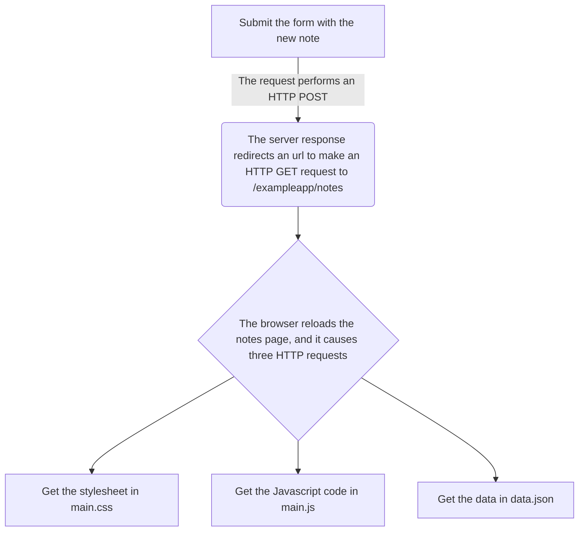
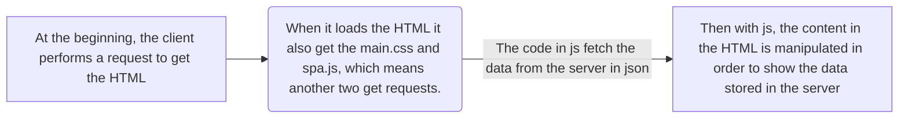

## Parte 0.4



## Parte 0.5



## Parte 0.6

```mermaid

    flowchart LR
    A[When the user saves the new note it causes the execution of form´s event handler.] -->|The function creates a note object with the content of the input and the creation date.|
    B(the object is saved in the array of notes)
    B --> D[The function redrawNotes is called to modify the HTML]-->C[Lastly, the object note is sent to the server]
    
```


